# Creating new animations

**HELP**: If you get stuck on any part of this guide, or have any questions about the systems available, I can normally be contacted on Discord under the @epicguru handle or by opening an issue on this page.

## Basic setup
First, you need to clone or download the Melee Animation mod into your local `Mods` folder from the Github page: you can't just copy the Steam version because it does not include the source files.  
Next, you will need your own mod set up to put the new animations into.  
You should have a mod folder set up, with an `About.xml` file so that the mod can load correctly, even if the mod has no content or code.  
Next **create a new folder** inside your mod folder, call it `Animations`.  
Your mod folder structure should now look like this:  
```
MyModName/  
├─ About/  
│  ├─ About.xml  
├─ Animations/  
├─ Defs/  
...
```

## Setting up the editor

Open the folder of your local copy of the Melee Animation mod.  
Inside the `Source/Animations` folder is a Unity project that is used to create the animations for this mod.  
The [Unity Animation Editor](https://docs.unity3d.com/6000.0/Documentation/Manual/animeditor-UsingAnimationEditor.html) is used to create animations using keyframes - if you have used Blender, Spine or other keyframe animation software, you will find it quite easy to use.  
A full Unity and Unity animation tutorial is outside the scope of this guide, so please take some time to understand the editor if you are not already familiar with it.

 - Install Unity Editor version 6 (6000.0) or above.
 - Add the Animation project, in the `Source/Animations`, to Hub to allow you to open it:  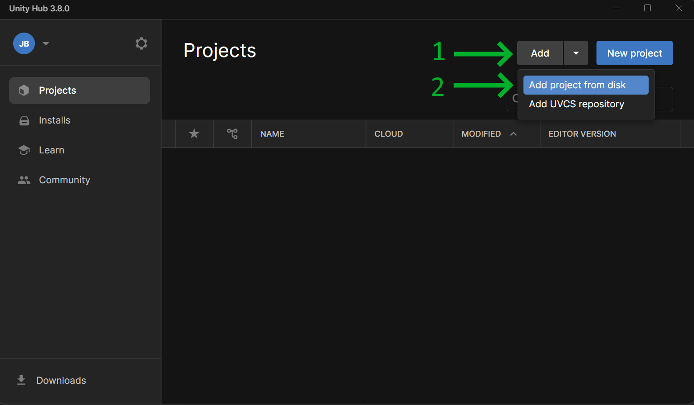
 - Open the Animation project. You may see a warning about changing the unity editor version, this is fine.
 - Once the project has opened (this may take a while the first time), you should see a button in the top menu called `Melee Animation`.  
   Click this button, then click `Set Export Location`. This will tell the editor where to put the animation files that you create.
   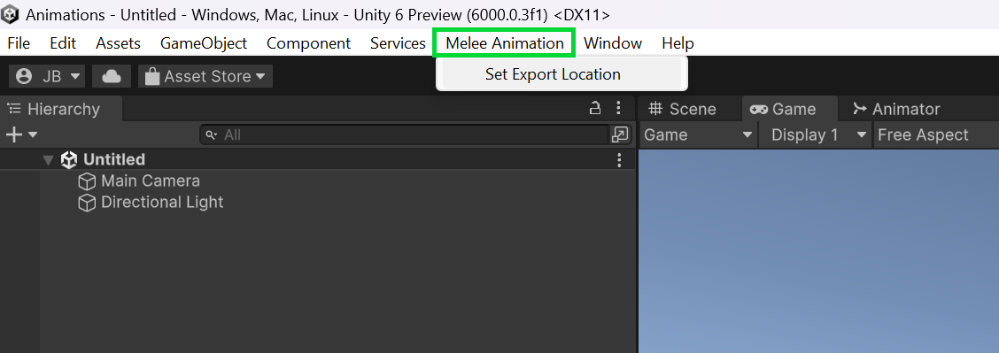
 - Set the export location to the `Animations` folder, inside your mod folder, that you created earlier.
 - From the top menu, select *File > Open Scene* and open the scene at `Assets/Scenes/SampleScene.unity`. You should now have something like this:  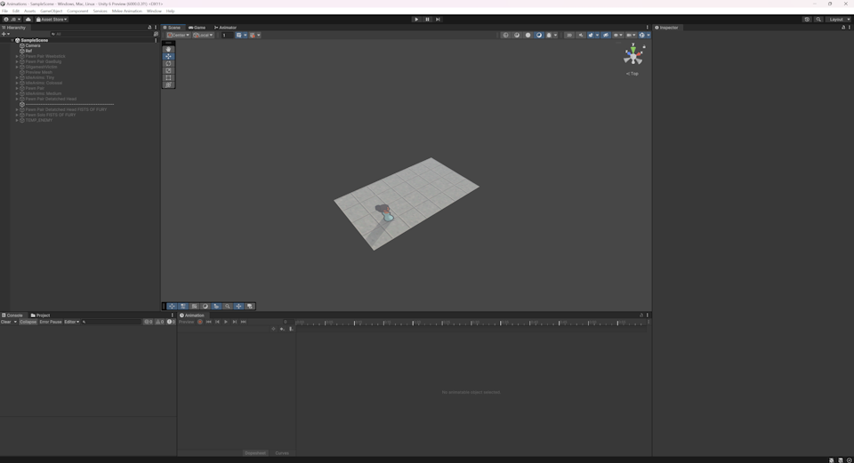
 - Next you need to adjust the camera so that it is suitable to animate characters. In the top-right of the Scene view, click the following in this order:
   1. The green *Y* arrow.
   2. The center white box.
   3. The 'lock' icon.  
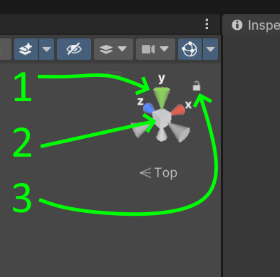
 - Almost ready to animate! Make sure you have the *Animation* window open, press `Ctrl+6` if it is not open to open it quickly.

## What rig to use?
In the hierarchy on the left you will see several game objects with different names. Each of these 'rigs' are used to create different types of animations.
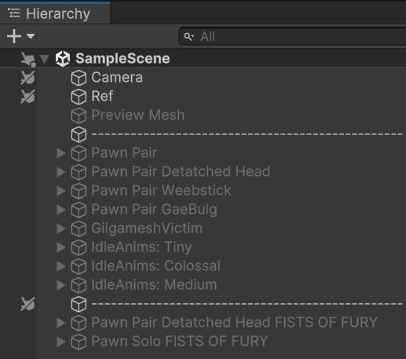  
A breakdown of the existing rigs are as follows:  
| Rig Name                 | Used For                                                                                                 |
|--------------------------|----------------------------------------------------------------------------------------------------------|
| Pawn Pair                | Generic two-pawn rig, used for almost all execution and duel animations.                                 |
| Pawn Pair Detatched Head | Two-pawn rig, used for execution animations that need to behead the victim.                              |
| Pawn Pair Weebstick      | Rig used for the Scarlet Edge unique skill execution.                                                    |
| Pawn Pair GaeBulg        | Rig used for the GaeBulg unique execution.                                                               |
| GilgameshVictim          | Rig used for the Mystic Summon unique skill execution.                                                   |
| IdleAnims: Tiny          | Rig used for the idle animations for Tiny weapons, including movement, attacking and flavour animations. |
| IdleAnims: Medium        | Same as above, for Medium weapons.                                                                       |
| IdleAnims: Colossal      | Same as above, for Colossal weapons.                                                                     |


**Generally you will want to use the `Pawn Pair` rig to create execution animations.**

Start by clicking on the Pawn Pair object and enabling it in the Inspector tab:  
  

You should now see something like this:
  
If you do not see the two pawns, double click on the Pawn Pair object, this will focus the scene camera on them.  
You can zoom using the scroll wheel, and move the camera by pressing down the middle mouse button and dragging.

## Animation controls
As a reminder, this will not be a full 'how to use Unity animator' tutorial.  
Instead, I will explain the controls that are unique to this Rimworld animation rig.  
I will explain how to make a simple execution animation, from there you should be able to create your own. I also suggest inspecting the existing animations to figure out how they all work.  
- First, let's create a new animation. You can name the animation anything you want, and it does not matter where you save the animation (`.anim` file) as long as it is somewhere under the `Assets` folder.  
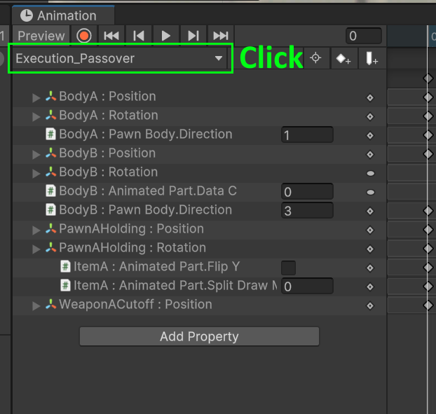  
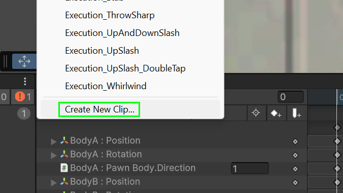  
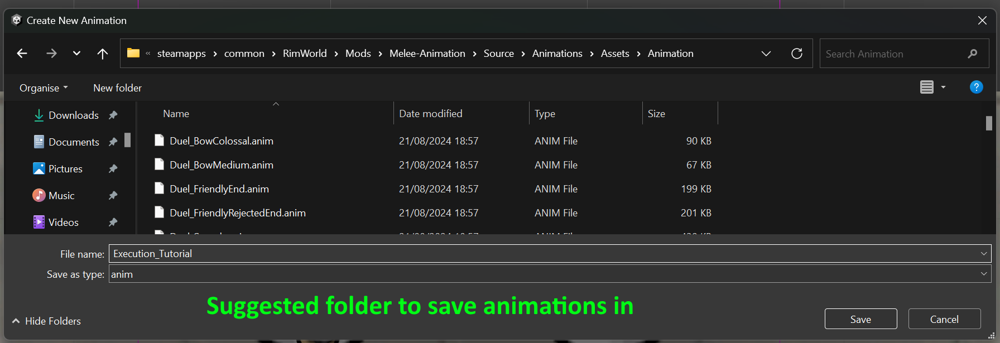  
I will create a new animation called *Execution_Tutorial*, but name yours whatever you want.
- Now you can begin animating!  
  Let me explain some of the specific controls in the rig. Expand the `Pawn Pair` hierarchy so that you can see some of the inner parts.
  Here is a list of the parts and what they do/are:
  1. **BodyA**: This is the attacking pawn's body. You can move, rotate and show/hide the pawn using this part.
  2. **BodyB**: This is the victim pawn's body. This is the pawn that is being executed.
  3. **PawnAHolding**: This is a combination of the attacking pawn's hands and weapon. This will be your main control to swing the weapon around. Notice that this part is not a child of the body: this means that they move independently of each other, I find that this is easier to animate. You will see that the weapon looks like a Vanilla longsword: this will be replaced in-game with whatever the pawn is using automatically.
  4. **PawnBHolding**: Same as above, but for the victim pawn. Note that this is hidden by default, you must manually enable it in your animation if you want the victim pawn to show their hands or weapon.
  5. **WeaponACutoff**: This is a special, invisible object that is used to allow the attacking pawn's weapon to stick 'through' the victim.  
  This is an optional feature that will be explained later.

I need to go into a bit more detail for certain parts.

### Draw order / Layering
You can change the order that things draw in by changing the Z position of them.

### Showing and hiding objects
You can simply enable or disable game objects to hide or show them, this includes the entire pawn if you want to hide the pawn.

### Pawn facing direction
The pawn's rotation can be animated simply by rotating the game object, but in order to change the direction they are *facing* (north, east, south, west), you need to select the Body object (*BodyA* or *BodyB*). You will see a Pawn Body component in the inspector, which contains a *Direction* property. This property can be changed to change the direction the pawn is facing, and of course this property can be keyframed.  
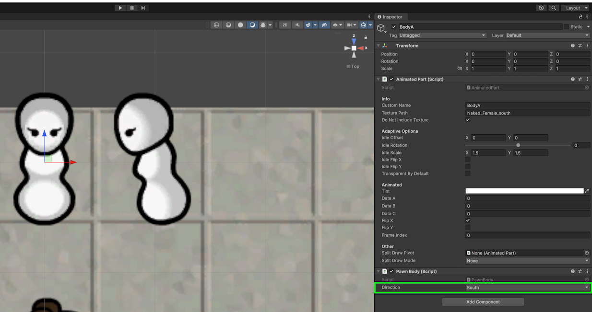  

### Moving hands away from weapon
If for some reason you want to move a pawn's hands away from their weapon, you can do this by expanding the *PawnAHolding* object. Inside you will have two hand objects which you can move independently of the weapon, which is the object called *ItemA*.

### Stabbing the weapon through/into something
Remeber the *WeaponACutoff* object? This is used to allow the main weapon to stab through or into an object.  
Select the *ItemA* object, and in the Inspector you will see *Split Draw Mode* at the bottom. This controls how the weapon draws. 
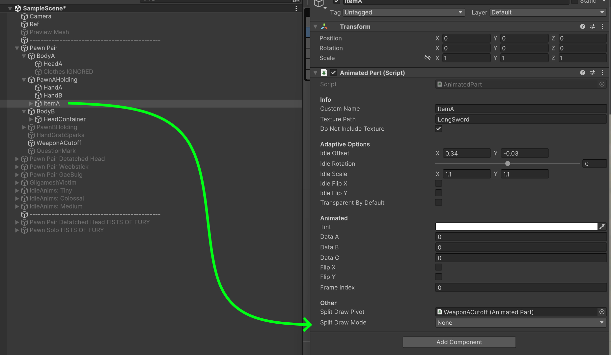  

I will explain each mode:  
- **None**: This is the default mode. The entire weapon is drawn.
- **Before**: The weapon is only drawn *before* the cutoff point; the part past the cutoff point is invisible.
- **After**: The weapon is only drawn *after* the cutoff point; the part before the cutoff point is invisible.
- **Before and After**: The weapon is drawn before and after the cutoff point, but the part after the cutoff point is put in the background i.e. behind the enemy pawn. This is useful to show the sword sticking through the enemy.  

Please inspect the existing animations to get a better understanding of how the modes work, and how the cutoff object is placed to achieve the desired effect. Remember, if you do not want to bother with this system, you do not have to use it.

**Important note**: The split draw mode does not show up in the editor! It will only work in Rimworld.

## Animation events
Animation events are an important part of the animations. They tell the mod when certain events occur during the animation, such as a pawn being hit, or killed, or when to play a sound effect or spawn a particle effect.  
Fully explaining the event system is outside of the scope of this tutorial (contact me for details if you need them), but I will explain the essentials:  

**First, the 'kill' event tells the mod when (and how) the animation should end if the execution outcome is 'killed'.**
This is how it works: the mod will determine the outcome of the execution attempt. If the outcome is 'kill', then the animation will play up until the point that a 'kill' event is encountered. If the outcome is anything else, then the animation will play all the way to the end, ignoring the kill event. This is important because it allows you to design the animation to account for the pawn dying or surviving: please see the `Execution_Shank` animation in the editor for an example of this in action.

Here is how you add events to your animation:  
First, move the animation to the time that you want to put the event at, then click this button to create a new event:  
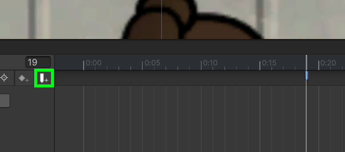  
Next, in the Inspector window, set the *Function* to `AnimationDataCreator > Methods > AnimEvent (AnimBase)`:  
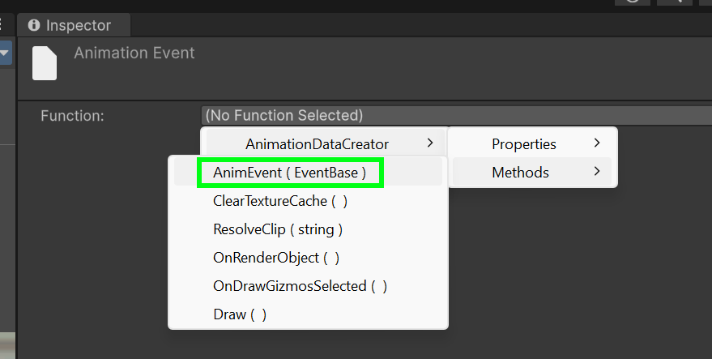  
Finally, click the round button to set the type of event, and select the `Kill_HeartStab` event. This event means that the victim pawn will be killed by being stabbed in the heart. It is possible to change the specific killing blow, but it is outside the scope of this tutorial, contact me if necessary.  
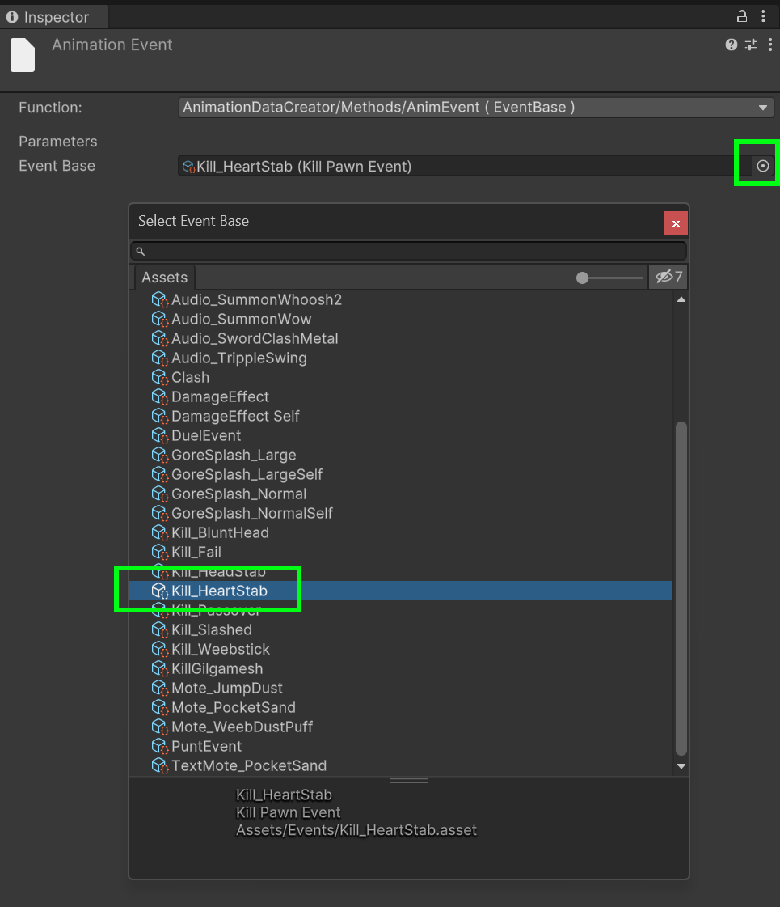  

**Important**: If you do not add a Kill event to your execution animation, it will never kill or injure the victim! So make sure to add the event, even if it is on the last frame of the animation.

## Exporting the animation
Finally, you are ready to export your animation(s).
First, select the `Pawn Pair` object in the Heriarchy (or whatever rig you are using).  
Then make sure that your animation is currently selected in the Animation window.  
Finally, in the Inspector window, click the *Save to file* button: this will export **the currently active animation** to your mod folder. You need to repeat this process for each of your animations.  
**Do *not* click the Save ALL to file button**, because this will export all of the vanilla animations to your mod folder.  
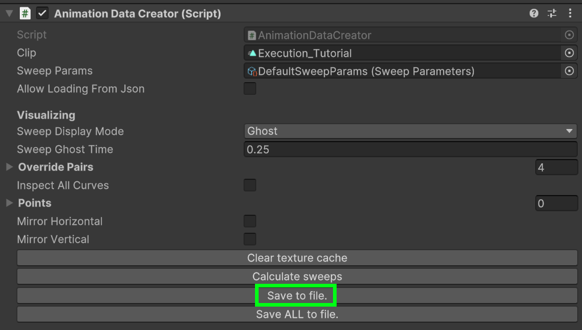  

Congrats! You should now have a file called `Execution_Tutorial.json` inside the `Animations` folder in your mod. That json file is the data that the mod loads to play your animation. There is only one final step to get your animation into the game.

## Creating an animation def
The final step to getting the animation in the game is to create an animation def to tell the animation mod about your new execution animation.  
Create a new XML def file in your mod's `Defs` folder.  
Inside the def file, add the following Def:
```XML
<AM.AnimDef ParentName="AnimExecutionBase">
  <defName>MyMod_Execution_Tutorial</defName>
  <label>Execution: Tutorial</label>
  <data>Execution_Tutorial.json</data> <!-- Replace this with the name of your animation json file -->
  <weaponFilter Class="AM.Reqs.AnyType">
    <types>Short_Stab, Long_Stab</types>
  </weaponFilter>
</AM.AnimDef>
```
You should obviously change the name, def name etc. as needed.  
The `weaponFilter` property is important: this determines what type of weapon(s) are allowed to do your execution animation.
In the example above, any short stabbing weapon, or long stabbing weapon is allowed to do the animation.  
Here are all the possible options:  
`Short_Stab`, `Short_Blunt`, `Short_Sharp`, `Long_Stab`, `Long_Blunt`, `Long_Sharp`.
Stabbing weapons are those with a sharp point, blunt weapons are those with a blunt edge, and sharp weapons are those with a sharp edge.  
Weapons can be part of more than one category, for example a longsword is both `Long_Sharp` and `Long_Stab`.  

---

# Testing your animation

That is all! If you've made it this far, well done. You can now see your execution animation in-game by opening the developer actions window, then going to the *Melee Animation* category and clicking *Open Debugger*.  
In the popup that opens, change it's type to *Animation Starter*. This will allow you to select your animation from the dropdown menu and play it on any two pawns of your liking!  
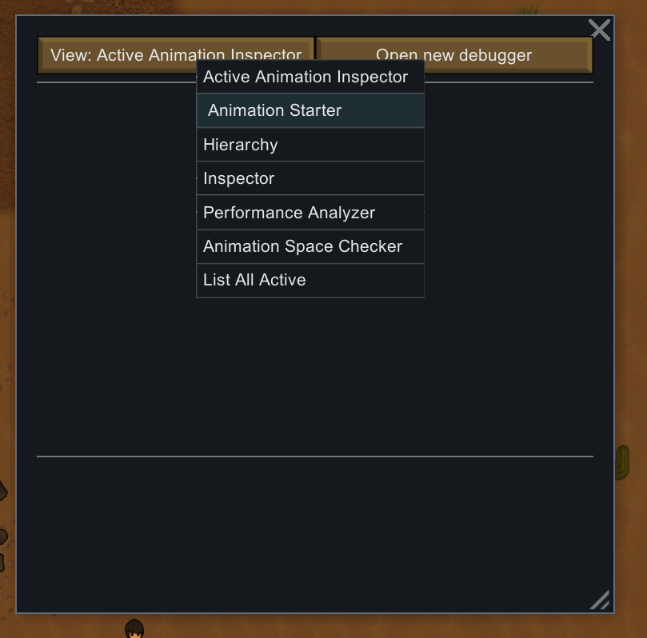  

## Publishing your animations

To share your animations with others, simply share your mod with the `Animations` folder.